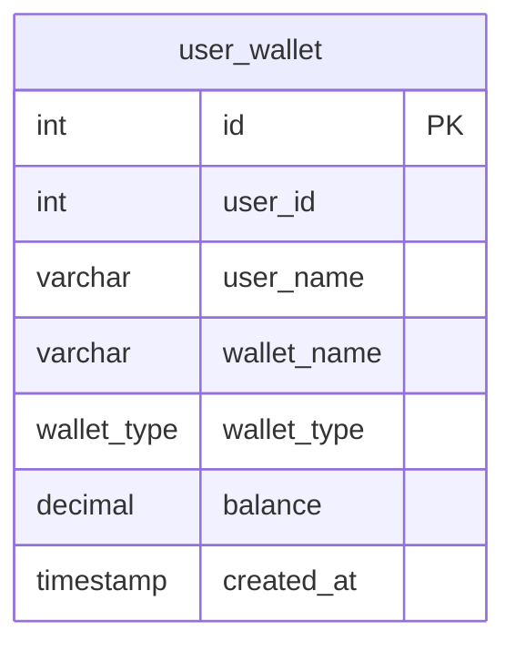

# Fun Exercise: API Design and DevOps

# Prerequisites

- [Go](https://go.dev/doc/install) - 1.21.8 or higher
	- Mac: `brew install go` [Homebrew](https://brew.sh/) or visit [Go](https://go.dev/doc/install)
	- Windows: `choco install go` [Chocolatey](https://chocolatey.org/install)
	- Linux: `sudo apt-get install golang-go`
    - Verify installation: `go version`
- [Docker](https://docs.docker.com/get-docker/)
- [Swag](https://github.com/swaggo/swag) - Generate Swagger Documentation
  - Install swag: `go install github.com/swaggo/swag/cmd/swag@latest`
  - Make sure `swag` is installed

# Getting Started
1. Clone the repository
2. Open `fun-exercise-api` in your favorite Editor
3. Before running the code, you need to make sure all of these tools are installed
    - [x] Go
    - [x] Docker
    - [x] [Swag](#getting-started)
4. Run the following command to start the server
    ```bash
    docker-compose up

    go run main.go
    ```
5. Open your browser and navigate to [http://localhost:1323/api/v1/wallets](http://localhost:1323/api/v1/wallets)
6. You should see a list of wallets
7. View Swagger documentation at [http://localhost:1323/swagger/index.html](http://localhost:1323/swagger/index.html)
8. You should see the Swagger documentation for the API


9. We've created a simple database schema for Wallet `init.sql`




## Table of Contents
- [Challenge 0: Starter Code - Display a list of wallets](#challenge-0-display-a-list-of-wallets-)
- [Challenge 1: API - Using environment variables](#challenge-1-api---using-environment-variables)
- [Challenge 2: API - Write Unit Test for /ap/v1/wallets](#challenge-2-api---write-unit-test-for-apv1wallets)
- [Challenge 3: API - Using Query Parameters](#challenge-3-api---using-query-parameters)
- [Challenge 4: API - Using Path Parameters](#challenge-4-api---using-path-parameters)
- [Challenge 5: API - Using Request Body to Create a Wallet](#challenge-5-api---using-request-body-to-create-a-wallet)
- [Challenge 6: API - Using Request Body to Update a Wallet](#challenge-6-api---using-request-body-to-update-a-wallet)
- [Challenge 7: API - Using Request Body to Delete a Wallet](#challenge-7-api---using-request-body-to-delete-a-wallet)
- [Challenge 8: DevOps - Dockerize the App - Multi-Stage Dockerfile](#challenge-8-devops---dockerize-the-app---multi-stage-dockerfile)
- [Challenge 9: DevOps - Design a CI for running static code analysis and tests](#challenge-9-devops---design-a-ci-for-running-static-code-analysis-and-tests)

### Challenge 0: Display a list of wallets ✅
We've prepared a simple API, database schema for Wallets, and Swagger documentation

- Simple API that displays a list of wallets [http://localhost:1323/api/v1/wallets](http://localhost:1323/api/v1/wallets)
- Connecting to a Postgres database and query all wallets from `user_wallet` table
- Create Swagger documentation for the API via `swag init`
- `wallet/handler.go` - You'll see the comments pattern that is used to generate the Swagger documentation
```go
// 	WalletHandler
//	@Summary		Get all wallets
//	@Description	Get all wallets
//	@Tags			wallet
//	@Accept			json
//	@Produce		json
//	@Success		200	{object}	Wallet
//	@Router			/api/v1/wallets [get]
//	@Failure		500	{object}	Err
func (h *Handler) WalletHandler(c echo.Context) error {
	wallets, err := h.store.Wallets() // Query all wallets
	if err != nil {
		return c.JSON(http.StatusInternalServerError, Err{Message: err.Error()})
	}
	return c.JSON(http.StatusOK, wallets)
}
```

### Challenge 1: API - Using environment variables
As a developer, we need to deploy the application on the cloud, we need to prepare the application and make it ready for the cloud environment.
One of the best practices is to store the configuration in the environment variables.
In 12 Factors App, it's recommended to store the configuration in the environment variables.

This challenge is to replace the hardcode of the connection string in the code with the environment variables.

1. Jump to the `postgres` package
2. Edit `postgres/postgres.go` and replace the connection string with the environment variables instead.

#### Expectation
```
No hardcode of the connection string in the code
```


### Challenge 2: API - Write Unit Test for /ap/v1/wallets
As a developer, we need to make sure the code is working as expected.

This challenge is to write a unit test for the `/api/v1/wallets` endpoint and practice how to **Test Double**.

1. Jump to the `wallet_test.go` file in the `wallet` package
2. We've created draft of the test cases
3. We need to implement the test cases and learn how to break dependency by **Test Double**
	```go
	func TestWallet(t *testing.T) {
		t.Run("given unable to get wallets should return 500 and error message", func(t *testing.T) {

		})

		t.Run("given user able to getting wallet should return list of wallets", func(t *testing.T) {

		})
	}
	```
4. Run the test cases `go test -v ./...`
5. You can see an example [coaching-week-3](https://github.com/KKGo-Software-engineering/coaching-session/blob/main/week-3/product/product_test.go)

#### Expectation
```
1. Test Double should be used to break the dependency for those test cases
2. All test cases should pass
3. Feel free to add more test cases
```


### Challenge 3: API - Using Query Parameters
As a user, I want to filter the wallets based on the type of wallet.

This challenge is to use query parameters to filter the type of wallets `?wallet_type=Saving`

1. Jump to the `wallet/handler.go` file in the `wallet` package
2. Add new logic for supporting query parameters
3. Add Swagger document for that change via `swag init`
4. Learn more about [Query Parameters](https://echo.labstack.com/guide/request#query-parameters)

#### Expectation
```
1. Filter the wallets based on the query parameters
2. Using appropriate HTTP methods and HTTP status code
3. JSON response should be returned
4. Swagger documentation should be implemented

```

### Challenge 4: API - Using Path Parameters
As a user, I want to get the wallet for a specific user.

This challenge is to use path parameters to get the wallet for a specific user `users/:id/wallets`

Learn more about [Path Parameters](https://echo.labstack.com/guide/request#path-parameters)
#### Expectation
```
1. Get the wallet for the specific user
2. Using appropriate HTTP methods and HTTP status code
3. JSON response should be returned
4. Swagger documentation should be implemented
```

### Challenge 5: API - Using Request Body to Create a Wallet
As a user, I want to create a wallet.

This challenge is to use the request body to create a wallet `/api/v1/wallets`

#### Expectation
```
1. Using appropriate HTTP methods and HTTP status code
2. JSON response should be return the wallet was just created
3. Swagger documentation should be implemented
```

### Challenge 6: API - Using Request Body to Update a Wallet
As a user, I want to update a wallet.

This challenge is to use the request body to update a wallet `/api/v1/wallets`

#### Expectation
```
1. Using appropriate HTTP methods and HTTP status code
2. JSON response should be return the wallet was just updated
3. Swagger documentation should be implemented
```

### Challenge 7: API - Using Request Body to Delete a Wallet
As a user, I want to delete a wallet out of specific user.

This challenge is to use the request body to delete a wallet `/api/v1/users/:id/wallets`

#### Expectation
```
Return appropriate response **HTTP status code**
```

### Challenge 8: DevOps - Dockerize the App - Multi-Stage Dockerfile
As a DevOps, we need to prepare the application for deployment and make it ready for the cloud environment.

This challenge is to create a Dockerfile for the `Go` application and make sure image size is optimized.

#### Expectation
```
1. Create a Dockerfile for the Go application
2. Using multi-stage Dockerfile
3. The image size should be optimized
4. The image should be able to run the application (container)
```

### Challenge 9: DevOps - Design a CI for running static code analysis and tests
As a DevOps, we need to design a CI for running static code analysis and tests.

This challenge is to design a CI (Github Action) for running static code analysis and tests.

#### Expectation
```
1. The CI should be able to run static code analysis suche go vet ./... or staticcheck or golangci-lint
2. The CI should be able to run the tests
3. All tasks on the CI should be passed
4. Feel free to add more tasks - e.g. build the Docker image
```
