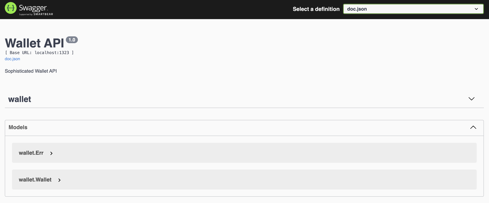
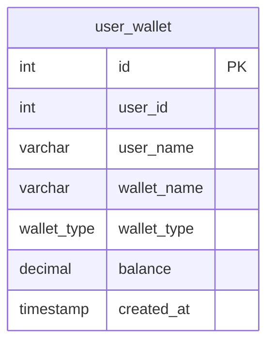

# Fun Exercise: API Design and DevOps

# Prerequisites

- [Go](https://go.dev/doc/install) - 1.21.8 or higher
	- Mac: `brew install go` [Homebrew](https://brew.sh/) or visit [Go](https://go.dev/doc/install)
	- Windows: `choco install go` [Chocolatey](https://chocolatey.org/install)
	- Linux: `sudo apt-get install golang-go`
    - Verify installation: `go version`
- [Docker](https://docs.docker.com/get-docker/)
- [Swag](https://github.com/swaggo/swag) - Generate Swagger Documentation
  - Install swag: `https://github.com/swaggo/swag`

# Getting Started
1. Clone the repository
2. Open `fun-exercise-api` in your favorite Editor
3. Run the following command to start the server
	```bash
	docker-compose up

	go run main.go
	```
4. Open your browser and navigate to [http://localhost:1323/api/v1/wallets](http://localhost:1323/api/v1/wallets)
5. You should see a list of wallets
6. View Swagger documentation at [http://localhost:1323/swagger/index.html](http://localhost:1323/swagger/index.html)
7. You should see the Swagger documentation for the API


8. We've created a simple database schema for Wallet `init.sql`




## Table of Contents
- [Challenge 0: Starter Code - Display a list of wallets](#challenge-0-display-a-list-of-wallets-)
- [Challenge 1: API - Using environment variables](#challenge-1-api---using-environment-variables)
- [Challenge 2: API - Write Unit Test for /ap/v1/wallets](#challenge-2-api---write-unit-test-for-apv1wallets)
- [Challenge 3: API - Using Query Parameters](#challenge-3-api---using-query-parameters)
- [Challenge 4: API - Using Path Parameters](#challenge-4-api---using-path-parameters)
- [Challenge 5: API - Using Request Body to Create a Wallet](#challenge-5-api---using-request-body-to-create-a-wallet)
- [Challenge 6: API - Using Request Body to Update a Wallet](#challenge-6-api---using-request-body-to-update-a-wallet)
- [Challenge 7: API - Using Request Body to Delete a Wallet](#challenge-7-api---using-request-body-to-delete-a-wallet)
- [Challenge 8.0: DevOps - Dockerize the App - Single Stage Dockerfile](#challenge-80-devops---dockerize-the-app---single-stage-dockerfile)
- [Challenge 8.5: DevOps - Dockerize the App - Multi-Stage Dockerfile](#challenge-85-devops---dockerize-the-app---multi-stage-dockerfile)
- [Challenge 9: DevOps - Design a CI for running static code analysis and tests](#challenge-9-devops---design-a-ci-for-running-static-code-analysis-and-tests)

### Challenge 0: Display a list of wallets ✅
- We've created a simple API that displays a list of wallets [http://localhost:1323/api/v1/wallets](http://localhost:1323/api/v1/wallets)
- Connecting to a Postgres database and query all wallets from `user_wallet` table
- Create Swagger documentation for the API via `swag init`
- `wallet/handler.go` - You'll see the comments pattern that is used to generate the Swagger documentation
```go
// 	WalletHandler
//	@Summary		Get all wallets
//	@Description	Get all wallets
//	@Tags			wallet
//	@Accept			json
//	@Produce		json
//	@Success		200	{object}	Wallet
//	@Router			/api/v1/wallets [get]
//	@Failure		500	{object}	Err
func (h *Handler) WalletHandler(c echo.Context) error {
	wallets, err := h.store.Wallets() // Query all wallets
	if err != nil {
		return c.JSON(http.StatusInternalServerError, Err{Message: err.Error()})
	}
	return c.JSON(http.StatusOK, wallets)
}
```

### Challenge 1: API - Using environment variables
12 Factors App - [Config](https://12factor.net/config) - Store config in the environment

- Jump to the `postgres` package
- Edit `postgres/postgres.go` and replace the connection string
- **Expectation**: No hardcode of the connection string in the code


### Challenge 2: API - Write Unit Test for /ap/v1/wallets
- Jump to the `wallet_test.go` file in the `wallet` package
- We've created draft of the test cases
- We need to implement the test cases and learn how to break dependency by **Test Double**
```go
func TestWallet(t *testing.T) {
	t.Run("given unable to get wallets should return 500 and error message", func(t *testing.T) {

	})

	t.Run("given user able to getting wallet should return list of wallets", func(t *testing.T) {

	})
}
```
- Run the test cases `go test -v ./...`
- **Expectation**: **Test Double** should be used to break the dependency for those test cases

### Challenge 3: API - Using Query Parameters
Using query parameters to filter the type of wallets `?wallet_type=Saving`

- **Expectation**: Filter the wallets based on the query parameters, appropriate **HTTP methods** and **HTTP status code**

### Challenge 4: API - Using Path Parameters
Using path parameters to get wallet for specific user`users/:id/wallets`

- **Expectation**: Get the wallet for the specific user, appropriate **HTTP methods** and **HTTP status code**

### Challenge 5: API - Using Request Body to Create a Wallet
Using request body to create a wallet `/api/v1/wallets`

- **Expectation**: Get the wallet just created, appropriate **HTTP methods** and **HTTP status code**

### Challenge 6: API - Using Request Body to Update a Wallet
Using request body to update a wallet `/api/v1/wallets`
- **Expectation**: Get the updated wallet, appropriate **HTTP methods** and **HTTP status code**

### Challenge 7: API - Using Request Body to Delete a Wallet
Using request body to delete a wallet `/api/v1/wallets`
- **Expectation**: Get appropriate response **HTTP status code**

### Challenge 8: DevOps - Dockerize the App - Multi-Stage Dockerfile
Create a Dockerfile for `Go` application and build the image

### Challenge 9: DevOps - Design a CI for running static code analysis and tests
Design a CI for running static code analysis and tests
